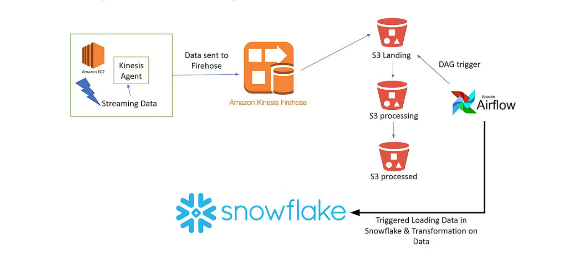

# AWS Snowflake Data Pipeline using Kinesis and Amazon MWAA (Managed Workflows for Apache Airflow)
This project demonstrates how to build an end-to-end data pipeline leveraging various AWS services (EC2, Kinesis Firehose, S3, MWAA) and Snowflake. The pipeline focuses on ingesting EC2 logs, transforming them, and storing the processed data in both Snowflake and S3.

## Aim of the Project
The primary goal of this project is to build a data pipeline that takes EC2 logs as its source, processes and transforms this data using Apache Airflow DAGs, and then stores the final, processed data in both Snowflake and S3.

## Dataset Description
This project utilizes two CSV files to simulate streaming data:
+ customers.csv: Contains customer-related information such as customer_ID, customer_name, customer_address, etc.
+ orders.csv: Contains order-related information such as order_ID, customer_ID, order_quantity, etc.

## Tech Stack Used
+ Languages: SQL, Python3
Services:
+ Amazon S3 (Simple Storage Service)
+ Snowflake
+ Amazon MWAA (Managed Workflows for Apache Airflow)
+ Amazon Kinesis Firehose
+ AWS EC2

## Project Overview and Architecture

## Explanation of Flow:

Streaming Data (EC2 & Kinesis Agent): Simulated application logs (customer and order data) are generated on an EC2 instance. The Kinesis Agent captures these logs.
Data Sent to Firehose: The Kinesis Agent sends the captured logs to Amazon Kinesis Firehose.
S3 Landing: Kinesis Firehose delivers the raw streaming data to an S3 Landing Zone bucket.
S3 Processing: An Apache Airflow DAG is triggered to move the data from the S3 Landing Zone to an S3 Processing Zone for further processing and transformation.
Snowflake Ingestion & Transformation: Data from the S3 Processing Zone is ingested into Snowflake tables, where transformations are applied using SQL queries.
S3 Processed: The processed and transformed data is then moved to an S3 Processed Zone for long-term storage and other downstream applications.

## Key Concepts Used
### Data Pipeline
A data pipeline is a system for moving and transforming data from one system to another. In this project, it involves acquiring data (EC2 logs), storing raw data (S3 Landing), cleaning, validating, and transforming data (Airflow & Snowflake), and finally storing processed data (Snowflake & S3 Processed).

### Amazon MWAA (Managed Workflows for Apache Airflow)
Amazon MWAA is a fully managed orchestration service for Apache Airflow. It simplifies the deployment, scaling, and management of Airflow environments in the cloud, allowing users to focus on defining data workflows with Python DAGs.

### AWS EC2 (Elastic Compute Cloud)
Amazon EC2 provides resizable compute capacity in the cloud as virtual servers (instances). It reduces the need for upfront hardware investment, enabling quick deployment and scaling of applications. In this project, an EC2 instance acts as the source of log data.

### Amazon S3 (Simple Storage Service)
Amazon S3 is an object storage service offering high scalability, data availability, security, and performance. It serves as the primary storage layer for raw, processing, and processed data throughout the pipeline.

### Amazon Kinesis Firehose
Amazon Kinesis Data Firehose is a fully managed service for delivering real-time streaming data to various destinations, including Amazon S3. It simplifies the process of capturing and delivering streaming data without managing underlying resources.

## Learning Takeaways
By undertaking this project, I have gained hands-on experience and understanding of:

+ AWS Services: Working with AWS Identity and Access Management (IAM), AWS S3, AWS Kinesis Firehose, and AWS EC2.
+ Infrastructure Setup: Creating EC2 instances, setting up Snowflake databases, and configuring connections between AWS services.
+ Data Streaming: Understanding and implementing real-time data streaming using Kinesis Agent and Kinesis Firehose.
+ Orchestration with Airflow: Learning about AWS Airflow (MWAA), creating Airflow clusters, developing Airflow DAGs, and orchestrating data pipeline tasks.
+ Data Warehousing with Snowflake: Setting up Snowflake databases, tables, and stages, and performing data ingestion and transformation using SQL.
+ End-to-End Data Pipeline: Building and understanding the flow of data through multiple stages of a modern data pipeline.

## Big Data Solution Approach
This project involves several key steps to construct the Kinesis-Snowflake data pipeline:

1. Dataset Understanding
The project utilizes two simulated datasets from an e-commerce store:

+ Customer Dataset: Contains customer_ID, customer_name, customer_address, etc.
+ Order Dataset: Contains order_ID, customer_ID, order_quantity, etc.
  
These CSV files will be used to generate logs on the EC2 instance.

2. Creating An S3 Bucket And EC2 Instance
S3 Bucket Creation: Setting up an S3 bucket to receive raw data from Kinesis Firehose and storing processed data. This also includes configuring the connection between S3 and Kinesis Firehose.
IAM Role and Policy Setup: Configuring necessary IAM roles and policies to grant the EC2 instance permissions to connect with Kinesis Firehose and send logs to AWS CloudWatch for monitoring.
EC2 Instance Setup: Launching an EC2 instance (e.g., using Amazon Linux 2 AMI), and preparing it for SSH access by converting the .pem key to a .ppk file (for PuTTY).
3. Transferring Data to Kinesis Firehose
Kinesis Firehose Delivery Creation: Creating two Kinesis Firehose Delivery Streams (one for customer data, one for order data) configured to receive data from the EC2 machine via Kinesis Agent and deliver it to the S3 Landing Zone.
Kinesis Agent Installation: Installing and configuring the Kinesis Agent on the EC2 instance to capture the customers.csv and orders.csv data files.
Moving Data to Kinesis Firehose Delivery: Starting the Kinesis Agent to monitor the data files. This step involves observing the real-time transfer of data to the Kinesis Firehose Delivery Streams and subsequently verifying its successful arrival in the S3 Landing Zone.
4. Setting Up Snowflake Databases, Tables, and Stages
Snowflake Account Setup: Creating a Snowflake account.
Database, Table, and Stage Creation: Setting up the necessary databases and tables in Snowflake to store the ingested data. This includes creating Snowflake external stages, which act as connectors between the S3 bucket and the Snowflake tables, enabling efficient data transfer.
5. Creating Airflow DAG For Snowflake Data Pipeline
DAG Development: Developing Apache Airflow Directed Acyclic Graphs (DAGs) in Python to orchestrate the data pipeline.
Data Movement Orchestration: The DAGs will be responsible for:
Moving raw data from the S3 Landing Zone to the S3 Processing Zone.
Triggering the data ingestion process into Snowflake from the S3 Processing Zone.
Applying transformations to the data within Snowflake using SQL queries.
Transferring the processed data from the S3 Processing Zone to the S3 Processed Zone.
6. Establishing Amazon MWAA Snowflake Connection
MWAA Environment Setup: Setting up an Airflow environment in AWS using Amazon MWAA. This involves creating an MWAA VPC through the CloudFormation console.
Snowflake Connection in Airflow: Configuring a connection to Snowflake within the Airflow environment, allowing DAGs to interact with your Snowflake database.
DAG Execution: Successfully running the developed Airflow DAGs to execute the end-to-end data pipeline tasks.
7. Data Ingestion and Transformation
Data Upload to Landing Folder: Manually uploading the initial data files (if simulating static files) or confirming the continuous flow from Kinesis Firehose into the S3 Landing folder.
Triggering Airflow DAG: Manually or automatically triggering the Airflow DAG to initiate the data movement from the Landing zone to the Processing zone in S3.
Snowflake Data Loading: Loading the data from the CSV files in the S3 Processing Zone into the corresponding Snowflake tables.
Data Transformation: Performing data transformations on the loaded Snowflake tables using SQL queries to clean, enrich, or aggregate the data as required.
Data Transfer to Processed Zone: Orchestrating the final transfer of the processed data from the S3 Processing Zone to the S3 Processed Zone, marking the completion of the data flow within the pipeline.
